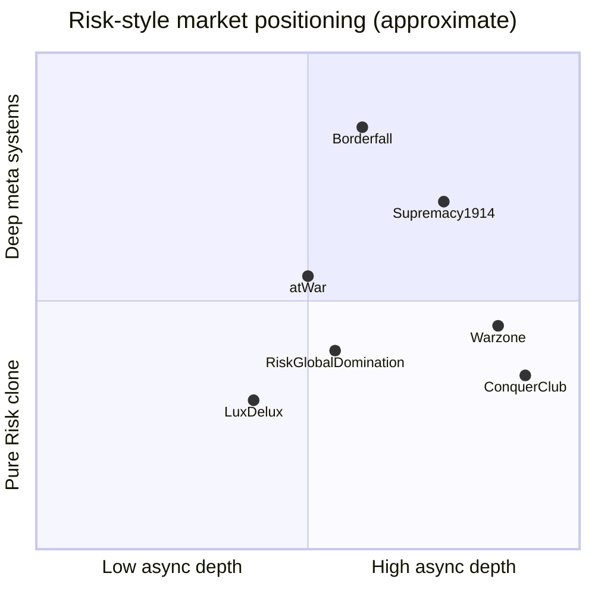

# Borderfall — Name & Competitive Landscape Analysis

**Prepared:** May 31, 2026  
**Scope:** US-focused trademark/IP review; worldwide competitor and availability scan (best-effort)  
**Disclaimer:** This document is informational research, not legal advice. Confirm trademark clearance and domain acquisition with qualified counsel before launch spend.

---

## Executive summary

**Recommendation: Keep the name Borderfall — with mitigations.**

Borderfall is a strong fit for the product: the compound *border + fall* aligns with territory conquest, collapsing empires, and the in-app taglines (“Every border is temporary.” / “When borders break, ages fall.”). No USPTO registration for **BORDERFALL** was found, and no competing game or app currently owns the name on major PC/mobile stores.

The main blockers are **asset availability**, not conceptual fit:

1. **`borderfall.com` is registered** (since 2002, HostGator nameservers) and not under project control.
2. **Social handles are partially occupied** — `@borderfall` on Instagram is taken; YouTube `@borderfall` resolves to an existing channel.
3. **Moderate confusion risk** with **Borderlands** (phonetic/visual overlap in gaming) and **SEO collision** with the *Octopath Traveler II* location “Borderfall.”

Gameplay-wise, Borderfall occupies a credible niche: a **Risk-style turn-based core** enriched with **historical eras, asymmetric factions, tech/economy/stability systems, 3D globe, ranked matchmaking, and campaign** — a combination none of the dominant Risk-likes offer as a unified package. Market risk is less about naming and more about competing against entrenched free products (especially **Warzone / War.app**) while all systems are polished simultaneously.

---

## Scoring rubric

Scores are 1–5 unless noted. Higher is better except **Confusion risk** (lower is better).

| Dimension | Score | Rating | Summary |
|---|---:|---|---|
| **Distinctiveness (TM)** | 4/5 | High | Suggestive compound mark; not merely descriptive of “strategy game.” |
| **Memorability** | 4/5 | High | Three syllables, clear imagery, reinforced by taglines. |
| **Availability (domains/handles/stores)** | 2/5 | Low | `.com` taken; several social handles taken; fallback TLDs available. |
| **Confusion risk (IP)** | 3/5 | Medium | Borderlands (gaming TM), Octopath location (SEO), Border&Fall agency (adjacent brand). |
| **SEO / discoverability** | 3/5 | Medium | Competes with Octopath wiki content; otherwise low existing brand noise. |
| **Gameplay differentiation** | 4/5 | High | Era depth + factions + globe + ranked + campaign vs. Risk-likes. |

**Overall:** Strong name for the game; **weak primary-domain and handle availability** require a deliberate acquisition or fallback strategy before marketing spend.

---

## 1. Naming analysis

### 1.1 Meaning and connotation

| Element | Interpretation | Fit for Borderfall |
|---|---|---|
| **Border** | Political/geographic boundaries, front lines, contested edges | Core to territory-control gameplay |
| **Fall** | Collapse, defeat, seasonal/historical decline (“fall of Rome”) | Matches conquest + era-based narrative |
| **Compound** | Borders failing → empires falling | Matches `TAGLINE_PRIMARY` / `TAGLINE_CINEMATIC` in [`frontend/src/constants/brand.ts`](../frontend/src/constants/brand.ts) |

The name reads as **serious/strategic**, not casual or cartoon — appropriate for historical war strategy. It avoids direct use of Hasbro’s **RISK®** mark while still communicating genre through marketing copy (“Risk-style,” “inspired by Risk”).

### 1.2 Pronounceability, spelling, and recall

| Factor | Assessment |
|---|---|
| **Pronunciation** | BOR-der-fall — unambiguous in English |
| **Spelling risk** | Moderate: confusion with **Borderlands** (extra “s”, “land” vs “fall”); possible typo **Boarderfall** |
| **Length** | 10 characters — fine for app icon wordmark and store listings |
| **Abbreviation** | `BF` already used in nav (`APP_NAME_NAV_SHORT`) |

### 1.3 Trademark distinctiveness (US, informational)

| Class | Assessment |
|---|---|
| **Arbitrary / suggestive** | **Suggestive-to-arbitrary compound** — stronger than purely descriptive marks like “Territory Wars” |
| **Descriptive risk** | Low for the whole mark; “border” alone might be weak, but “Borderfall” as a unit is registrable-style |
| **Existing USPTO mark “BORDERFALL”** | **None found** in public USPTO aggregators (May 2026) |

### 1.4 Tone fit vs. product

Borderfall’s shipped positioning (from README and brand constants):

- Turn-based territory strategy across **nine historical eras** (+ custom maps)
- **Asymmetric factions**, tech tree, economy, stability/population
- **3D globe**, ranked matchmaking, daily challenge, campaign, map editor

The name supports “historical borders collapsing across ages” better than prior names (**ChronoConquest**, **Eras of Empire**), which were more generic 4X/empire labels. **Borderfall** is more distinctive and less crowded in search results.

---

## 2. Competitive landscape

### 2.1 Market map

### 2.2 Direct competitors (Risk-style territory games)

| Product | Platform | Price model | Scale / community | Core strengths | Gaps vs. Borderfall |
|---|---|---|---|---|---|
| **[Warzone / War.app](https://apps.apple.com/us/app/war-app/id597467995)** | Web, iOS, Android | Free, no pay-to-win | 10,000+ multiplayer games/day; thousands of maps | Async simultaneous turns, clans, tournaments, mods, huge map library | No built-in historical era system, factions, tech tree, or 3D globe |
| **[RISK: Global Domination](https://play.google.com/store/apps/details?id=com.hasbro.riskbigscreen)** (SMG/Hasbro) | Mobile, Steam | F2P + heavy IAP | Official RISK brand; 120+ maps; millions of players | Brand recognition, frequent content drops, ranked Grandmaster | Monetization backlash; less “historical simulation” depth |
| **[Conquer Club](https://www.conquerclub.com/)** | Browser | Free (+ premium) | 200+ maps; deep tournament/clan ecosystem | Async multi-day games, fog/trench variants, strong community | Dated UX; no era-specific factions/tech/economy stack |
| **[Lux Delux](https://store.steampowered.com/app/341950/Lux_Delux/)** (Sillysoft) | Desktop, mobile | ~$10 one-time | 900+ maps; strong AI; online league | Map variety, moddable, fast games | Not browser-first; no globe or era narrative layer |
| **[atWar](https://atwar-game.com/)** | Browser | Free | Up to 40 players; city-based maps | Free movement (non-grid), diplomacy, custom scenarios | Different movement model; less “Risk card/phase” fidelity |

**Market leader:** Warzone/War.app — largest active community, best async UX, and strongest custom-map ecosystem. Any new entrant must win on **differentiation and polish**, not map count on day one.

### 2.3 Adjacent competitors (context only)

| Product | Genre | Relevance |
|---|---|---|
| **Supremacy 1914 / Call of War** (Bytro) | Long-term real-time grand strategy in browser | Competes for “historical strategy” time; different loop (real-time, weeks-long) |
| **Boardfall** (Steam, 2025) | Chess-wave defense | Name similarity only (`Board` vs `Border`); different genre |
| **Northgard, Civilization, etc.** | 4X/RTS | Different core loop; useful for “strategy gamer” audience overlap |

### 2.4 Borderfall differentiation matrix

| Feature | Borderfall | Warzone | RISK: Global Domination | Conquer Club | Lux Delux |
|---|:---:|:---:|:---:|:---:|:---:|
| Browser-first | Yes | Yes | Partial | Yes | No |
| Historical era maps (curated) | **9 + custom** | Community maps | Themed map packs | Community maps | 900+ generic |
| Asymmetric factions per era | **Yes** | No | Limited | No | No |
| Tech tree | **Yes** | Via mods | No | No | No |
| Economy / buildings | **Yes** | Via mods | No | No | No |
| Stability / population | **Yes** | No | No | No | No |
| 3D globe view | **Yes** | No | No | No | No |
| Ranked matchmaking (Glicko-style) | **Yes** | Yes | Yes | Score-based | League |
| Campaign / daily challenge | **Yes** | Community levels | Limited | Tournaments | Single-player |
| Secret missions | **Yes** | No | Secret Assassin mode | No | No |
| Map editor + hub | **Yes** | Yes | No | No | Yes |
| Official RISK brand | No | No (Risk-inspired) | **Yes** | No (Risk-inspired) | No |

**Positioning statement:** *Borderfall is the historical, era-based Risk-style game for players who want asymmetric factions, meta progression (tech/economy/stability), and a premium map experience (2D + globe) — not just another map browser.*

**Competitive risks:**

- Warzone’s **free + massive map/mod library** sets a high bar for async multiplayer.
- RISK: Global Domination owns **trademarked “Risk” mindshare** on mobile.
- Borderfall must ship **all differentiators polished together**; partial implementation reads as “another Risk clone with extra menus.”

---

## 3. Domain availability

**Checked:** May 31, 2026 via WHOIS (Verisign, nic.io, PIR, Google Registry).

| Domain | Status | Notes |
|---|---|---|
| `borderfall.com` | **Registered** | Created **2002-04-19**; registrar Tucows; NS `ns2277/2278.hostgator.com`; expires 2027-04-19 |
| `borderfall.io` | **Available** | WHOIS: “Domain not found” |
| `borderfall.gg` | **Available** | WHOIS: “NOT FOUND” |
| `borderfall.net` | **Available** | WHOIS: “No match” |
| `borderfall.org` | **Available** | WHOIS: “Domain not found” |
| `borderfall.app` | **Likely available** | Registry query returned no registrant record (verify before purchase) |
| `borderfall.game` | **Available** | WHOIS: “DOMAIN NOT FOUND” |
| `playborderfall.com` | **Available** | WHOIS: “No match” |
| `getborderfall.com` | **Available** | WHOIS: “No match” |
| `borderfallgame.com` | **Available** | WHOIS: “No match” |

**Critical finding:** The README and deployment docs assume `borderfall.com` and `noreply@borderfall.com`, but **the .com is not available for fresh registration**. Options:

1. **Acquire** `borderfall.com` from current registrant (broker/negotiation).
2. **Launch on fallback** (`playborderfall.com` + `borderfall.io`) until `.com` is secured.
3. **Do not** email from `@borderfall.com` until the domain is owned — use a controlled subdomain on an owned domain temporarily.

**Adjacent domain conflict:** [borderandfall.com](https://borderandfall.com/) — **Border&Fall**, a design/culture agency (India/NY). Different spacing and industry, but phonetic overlap in conversation and audio ads.

---

## 4. App store & platform name availability

| Platform | Search: “Borderfall” | Bundle / app ID | Result |
|---|---|---|---|
| **Apple App Store** | No known listing | `com.borderfall.app` (planned per README) | **Name appears open** (iTunes Search API returned error; no public listing found) |
| **Google Play** | No exact “Borderfall” match | `com.borderfall.app` | **404 — bundle ID not registered** (May 2026) |
| **Steam** | [Store search API](https://store.steampowered.com/api/storesearch/?term=Borderfall) | — | **0 results** |
| **itch.io** | Site search | — | **No “Borderfall” game** (similar: Boardfall, BreachFall, etc.) |
| **Epic Games Store** | No public listing found | — | **Appears open** |

**Legacy note:** README documents migration from `com.chronoconquest.app` to **`com.borderfall.app` as a new listing** — correct approach; do not attempt in-place rename on stores.

---

## 5. Social handle availability

| Handle | Status (May 2026) | Notes |
|---|---|---|
| **X / Twitter `@borderfall`** | **Unknown** | Automated checks blocked (HTTP 403); manual verification required |
| **Instagram `@borderfall`** | **Taken** | Profile exists (display “M”); not game-related |
| **YouTube `@borderfall`** | **Occupied** | URL resolves; channel metadata sparse — treat as unavailable |
| **TikTok `@borderfall`** | **Unknown** | Automated checks blocked (HTTP 403) |
| **Reddit `r/borderfall`** | **Unknown** | Reddit blocked automated checks (HTTP 403) |
| **Discord invite `borderfall`** | **Unknown** | No official game server found in search |

**Nearby brands using “border + fall” pattern:**

- **Border&Fall** — design agency, [instagram.com/borderandfall](https://www.instagram.com/borderandfall)

**Recommendation:** Secure **`@playborderfall`**, **`@borderfallgame`**, or era-themed variants immediately on platforms where `@borderfall` is taken.

---

## 6. US IP & trademark confusion risk

### 6.1 BORDERFALL mark

| Check | Result |
|---|---|
| USPTO word mark **“BORDERFALL”** | **No registration found** |
| Pending applications | **None found** in public search |
| Common-law use as game title | **No competing game/app** located |

**Action:** File USPTO Intent-to-Use or actual-use application in **IC 009** (downloadable game software) and **IC 041** (online gaming services) after counsel review.

### 6.2 Borderlands (primary confusion concern)

| Factor | Borderlands | Borderfall | Weight |
|---|---|---|---|
| **Sight** | Shared prefix “Border-” | Same prefix | Against |
| **Sound** | BORDER-land(z) | BORDER-fall | Moderate similarity | Against |
| **Meaning** | Lawless frontier setting | Collapsing borders / conquest | Different | For |
| **Goods** | AAA looter-shooter franchise | Turn-based strategy | Different subgenre | For |
| **Trade channels** | Steam, console, mobile | Browser + mobile (planned) | Overlap | Against |
| **Mark strength** | Famous in gaming (Gearbox/Take-Two) | New mark | Against |

**Registered mark:** [BORDERLANDS — USPTO Serial 86981855](https://uspto.report/TM/86981855), Gearbox Enterprises, LLC — covers downloadable video game programs (IC 009).

**Risk level: Medium.** A USPTO examiner or Gearbox could argue phonetic similarity for related entertainment software, but genre distance and different suffix reduce likelihood of confusion among typical consumers. **Mitigations:**

- Never use “Borderlands-like” marketing.
- Distinct visual identity (avoid cel-shaded orange palette associated with Borderlands).
- Use full word **Borderfall** in logo; avoid “BF” alone in consumer-facing store art where confusion with Borderlands shorthand could occur.

*This is not a clearance opinion — counsel should run a full knockout search.*

### 6.3 Hasbro RISK®

Hasbro actively enforces **RISK®** against confusing game names and descriptions ([example: Drisk takedown](https://www.electrowolff.com/trademark/siege.html)). Borderfall’s approach is acceptable if:

- Product name does **not** include “Risk,” “RISK,” or confusing variants (Drisk, etc.).
- Store copy uses **“Risk-style”** or **“inspired by Risk”** descriptively, not “the official Risk game.”
- Map topology remains original (Hasbro has asserted copyright in fictional territorial delineations in past disputes).

### 6.4 Other similar marks / uses

| Name | Type | Risk |
|---|---|---|
| **Borderfall** (Octopath Traveler II location) | In-game place name | **SEO only** — [Fandom wiki](https://octopathtraveler.fandom.com/wiki/Borderfall) ranks for the term |
| **Border Down** (2003 arcade shooter) | Legacy game | **Low** — different genre, no active franchise |
| **Boardfall** (Steam 2025) | Chess-wave game | **Low–medium** — visual typo confusion in search |
| **Border&Fall** | Design agency | **Low legal / medium brand noise** |
| **Mistfall Hunter**, **Waterfall Bank**, etc. | Unrelated “-fall” marks | **Low** |

---

## 7. SEO & discoverability

| Signal | Assessment |
|---|---|
| **Existing search noise** | Low for a standalone game brand |
| **Octopath Traveler II “Borderfall”** | **Moderate SEO competition** — wiki and Game8 guides rank for exact term |
| **Borderlands franchise** | Dominates “border…” gaming queries; Borderfall must rely on exact-match + “strategy” qualifiers |
| **Recommended SEO targets** | “Borderfall game,” “Borderfall strategy,” “historical Risk online,” era-specific landing pages |

**Content strategy:** Era-specific pages (WWII, Cold War, etc.) and “how to play” docs will outperform generic “Borderfall” SEO until brand authority builds.

---

## 8. Localization & connotation check

Quick sanity scan of major languages (non-exhaustive):

| Language | Notes |
|---|---|
| **English** | Neutral-positive; strategic tone |
| **Spanish / French / German** | “Border” cognates clear; “fall” as noun/verb may need tagline care in translation |
| **Japanese** | Transliteration ボーダーフォール is neutral; no obvious negative homophone |
| **Chinese** | Would require deliberate translation (not literal “border fall”) for market fit |

No major offensive meaning identified in English-first positioning.

---

## 9. Repo rebrand hygiene (legacy strings)

Status after May 2026 package and token rename:

| Area | Status |
|---|---|
| **User-facing UI copy** | Borderfall (`frontend/src/constants/brand.ts`, pages, native shells) |
| **Package names** | `@borderfall/shared`, `borderfall-frontend`, `borderfall-backend`, root `borderfall` |
| **Design tokens** | Tailwind palette uses `bf-*` (gold, dark, surface, border, text, muted) |
| **Documentation** | Legacy DB migration notes in README/DEPLOYMENT (intentional for existing deploys) |
| **Store/mobile docs** | Reference `com.chronoconquest.app` as legacy bundle (intentional) |

---

## 10. Prioritized action list

### Immediate (before marketing spend)

1. **Resolve `borderfall.com`** — broker purchase or commit to `playborderfall.com` + 301 plan when `.com` is acquired.
2. **Defensively register** `borderfall.io`, `borderfall.gg`, `playborderfall.com`, `borderfallgame.com` (and `.app` / `.game` if budget allows).
3. **Secure social handles** — `@playborderfall` / `@borderfallgame` on Instagram, YouTube, X, TikTok, Discord.
4. **File USPTO trademark** (IC 009 + 041) after attorney knockout search.
5. **Avoid Borderlands visual language** in key art and store screenshots.

### Pre-launch product/marketing

6. **Position explicitly** against Warzone/RISK Global Domination on differentiation (eras, factions, globe, campaign) — not “another free Risk.”
7. **SEO:** Publish era landing pages; monitor Octopath wiki ranking for “Borderfall.”
8. **Hasbro-safe copy audit** on store listings and ads (no “official Risk,” no confusing abbreviations).
9. ~~**Rename workspace packages**~~ — completed (`@borderfall/shared`, `borderfall-frontend`, `borderfall-backend`).

### Ongoing

10. Monitor new Steam/itch.io releases with “-fall” suffix names (Boardfall precedent).
11. Re-check app store collisions before Capacitor store submission (`com.borderfall.app`).

---

## Sources

| Source | URL | Accessed |
|---|---|---|
| Borderfall README / brand constants | Repo: `README.md`, `frontend/src/constants/brand.ts` | 2026-05-31 |
| WHOIS (borderfall.*) | Verisign, nic.io, PIR | 2026-05-31 |
| Steam store search API | https://store.steampowered.com/api/storesearch/?term=Borderfall | 2026-05-31 |
| Google Play search / bundle | https://play.google.com/store/ | 2026-05-31 |
| War.app (Warzone) | https://apps.apple.com/us/app/war-app/id597467995 | 2026-05-31 |
| RISK: Global Domination | https://play.google.com/store/apps/details?id=com.hasbro.riskbigscreen | 2026-05-31 |
| Conquer Club | https://www.conquerclub.com/ | 2026-05-31 |
| Lux Delux (Steam) | https://store.steampowered.com/app/341950/Lux_Delux/ | 2026-05-31 |
| atWar | https://atwar-game.com/ | 2026-05-31 |
| BORDERLANDS USPTO | https://uspto.report/TM/86981855 | 2026-05-31 |
| Hasbro RISK enforcement example | https://www.electrowolff.com/trademark/siege.html | 2026-05-31 |
| Octopath Traveler II “Borderfall” | https://octopathtraveler.fandom.com/wiki/Borderfall | 2026-05-31 |
| Border&Fall agency | https://borderandfall.com/ | 2026-05-31 |
| USPTO likelihood of confusion | https://www.uspto.gov/trademarks/search/likelihood-confusion | 2026-05-31 |

---

*End of report.*
